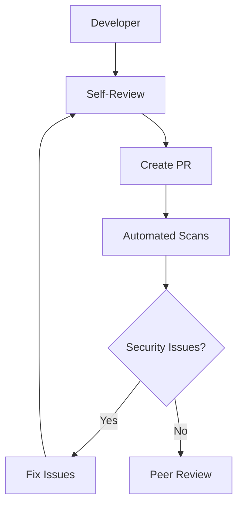
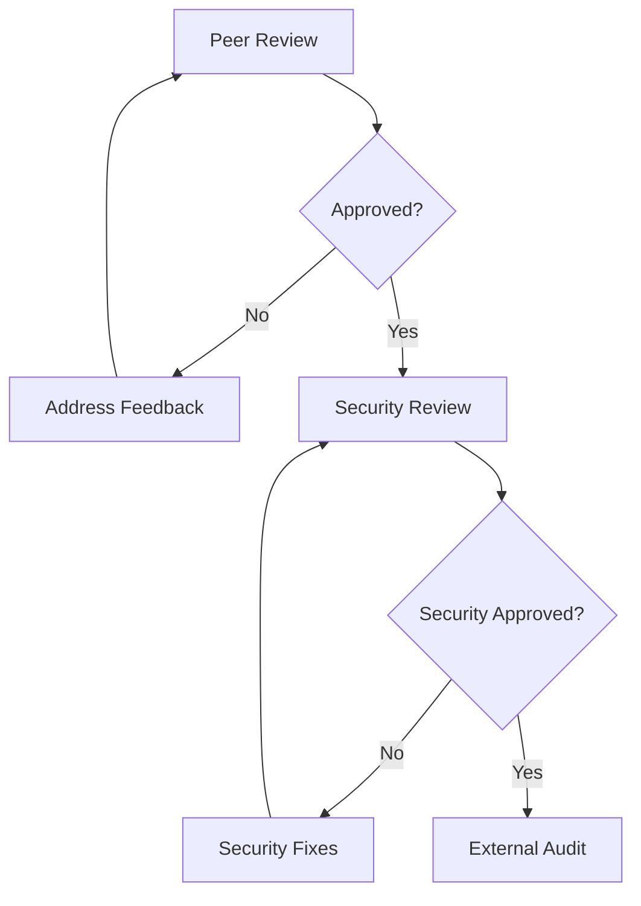
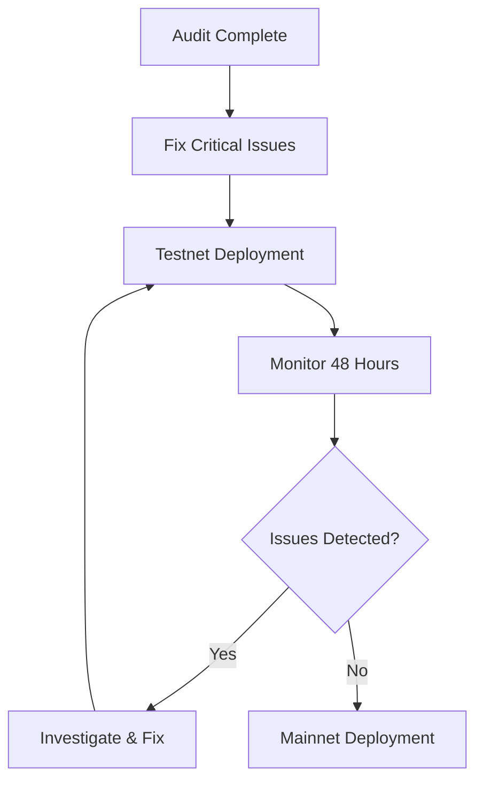

# Conxian Protocol Security Review Process

## Overview

This document outlines the comprehensive security review process for all changes to the Conxian Protocol. Security is our highest priority, and all code changes must undergo thorough review before deployment.

## Security Review Phases

### Phase 1: Initial Security Assessment

#### 1.1 Developer Self-Review

- **Timeline**: Before submitting PR
- **Checklist**:
  - [ ] Code follows security best practices
  - [ ] Input validation implemented
  - [ ] Access control properly configured
  - [ ] No hardcoded secrets or keys
  - [ ] Proper error handling
  - [ ] Gas optimization considered

#### 1.2 Automated Security Scanning

- **Tools**: Slither, Mythril, Custom Clarity linters
- **Checks**:
  - Reentrancy vulnerabilities
  - Integer overflow/underflow
  - Access control issues
  - Business logic flaws
  - Gas optimization issues

### Phase 2: Peer Review

#### 2.1 Technical Review

- **Reviewers**: 2+ protocol developers
- **Focus Areas**:
  - Code correctness and logic
  - Security implications
  - Performance impact
  - Integration compatibility

#### 2.2 Security Review

- **Reviewers**: Security team members
- **Focus Areas**:
  - Threat modeling
  - Attack surface analysis
  - Cryptographic implementations
  - Economic security considerations

### Phase 3: External Audit

#### 3.1 Third-Party Audit

- **Timeline**: 2-4 weeks
- **Auditors**: Reputable blockchain security firms
- **Scope**:
  - Smart contract code
  - Economic model
  - Integration patterns
  - Documentation accuracy

#### 3.2 Bug Bounty Program

- **Platform**: Immunefi or similar
- **Rewards**: Based on severity
  - Critical: $50,000+
  - High: $10,000-$50,000
  - Medium: $2,000-$10,000
  - Low: $500-$2,000

## Security Checklist

### Code Security

#### Access Control

- [ ] RBAC properly implemented
- [ ] Function permissions validated
- [ ] Admin functions protected
- [ ] Multi-signature for critical operations

#### Input Validation

- [ ] All external inputs validated
- [ ] Parameter ranges checked
- [ ] Type safety enforced
- [ ] Malicious input handling

#### Mathematical Operations

- [ ] Overflow/underflow protection
- [ ] Precision handling
- [ ] Division by zero checks
- [ ] Rounding errors considered

#### State Management

- [ ] Reentrancy protection
- [ ] State consistency checks
- [ ] Atomic operations
- [ ] Rollback mechanisms

### Economic Security

#### Token Economics

- [ ] Supply controls implemented
- [ ] Inflation mechanisms validated
- [ ] Distribution rules fair
- [ ] Manipulation resistance

#### Market Operations

- [ ] Price manipulation resistance
- [ ] MEV protection implemented
- [ ] Slippage controls
- [ ] Circuit breakers

#### Liquidity Management

- [ ] Liquidity depth analysis
- [ ] Withdrawal limits
- [ ] Emergency controls
- [ ] Insurance mechanisms

### Integration Security

#### Cross-Contract Calls

- [ ] Contract validation
- [ ] Call return handling
- [ ] Error propagation
- [ ] Gas limit considerations

#### Oracle Integration

- [ ] Price feed validation
- [ ] Stale price detection
- [ ] Deviation thresholds
- [ ] Backup oracles

#### External Dependencies

- [ ] Third-party contract audit
- [ ] Upgrade mechanisms
- [ ] Compatibility checks
- [ ] Fallback procedures

## Security Standards

### Clarity-Specific Security

#### 1. Language Features

```clarity
;; ✅ Safe integer operations
(define-safe-add (a b) 
  (if (> (+ a b) a) (+ a b) (err ERR_OVERFLOW)))

;; ❌ Unsafe operations
(define-unsafe-add (a b) (+ a b)) ; Can overflow
```

#### 2. Access Patterns

```clarity
;; ✅ Proper access control
(define-public (admin-only-function)
  (begin
    (asserts! (is-eq tx-sender (var-get contract-owner)) ERR_UNAUTHORIZED)
    ;; Function logic
  )
)

;; ❌ No access control
(define-public (unprotected-function)
  ;; Anyone can call this
)
```

#### 3. State Management

```clarity
;; ✅ Checks-Effects-Interactions
(define-public (safe-withdraw (amount uint))
  (begin
    (asserts! (>= (var-get user-balance) amount) ERR_INSUFFICIENT)
    (var-set user-balance (- (var-get user-balance) amount))
    (as-contract (contract-call? .token transfer amount tx-sender tx-sender none))
  )
)
```

### Common Vulnerabilities

#### 1. Reentrancy

```clarity
;; ❌ Vulnerable
(define-public (bad-withdraw (amount uint))
  (begin
    (as-contract (contract-call? .token transfer amount tx-sender tx-sender none))
    (var-set user-balance (- (var-get user-balance) amount))
  )
)

;; ✅ Protected
(define-public (good-withdraw (amount uint))
  (begin
    (asserts! (>= (var-get user-balance) amount) ERR_INSUFFICIENT)
    (var-set user-balance (- (var-get user-balance) amount))
    (as-contract (contract-call? .token transfer amount tx-sender tx-sender none))
  )
)
```

#### 2. Integer Overflow

```clarity
;; ❌ Vulnerable
(define-public (bad-add (a uint) (b uint))
  (+ a b) ; Can overflow
)

;; ✅ Protected
(define-public (safe-add (a uint) (b uint))
  (if (>= a (- u340282366920938463463374607431768211455 b))
    (+ a b)
    (err ERR_OVERFLOW)
  )
)
```

## Review Process Workflow

### 1. Change Submission



### 2. Review Approval



### 3. Deployment Process



## Security Tools & Infrastructure

### 1. Automated Scanning

- **Slither**: Static analysis for Clarity
- **Mythril**: Symbolic execution
- **Custom Linters**: Protocol-specific rules
- **CI/CD Integration**: Automated checks

### 2. Monitoring & Alerting

- **Real-time Monitoring**: Contract activity
- **Anomaly Detection**: Unusual patterns
- **Alert System**: Security team notifications
- **Incident Response**: Emergency procedures

### 3. Testing Infrastructure

- **Fuzzing**: Random input testing
- **Property Testing**: Invariant verification
- **Integration Tests**: Cross-contract scenarios
- **Load Testing**: Performance under stress

## Incident Response

### 1. Severity Classification

- **Critical**: Immediate threat to funds
- **High**: Significant security risk
- **Medium**: Limited security impact
- **Low**: Minor security issue

### 2. Response Timeline

- **Critical**: 1 hour response, 24 hour fix
- **High**: 4 hour response, 72 hour fix
- **Medium**: 24 hour response, 1 week fix
- **Low**: 72 hour response, 2 week fix

### 3. Communication Protocol

- **Internal**: Security team first
- **External**: Public disclosure after fix
- **Users**: Clear instructions for protection
- **Community**: Transparent updates

## Security Best Practices

### 1. Development

- Follow secure coding standards
- Use established libraries
- Implement defense in depth
- Regular security training

### 2. Testing

- Comprehensive test coverage
- Security-focused test cases
- Regular penetration testing
- Bug bounty program

### 3. Deployment

- Gradual rollout strategy
- Kill switch mechanisms
- Monitoring and alerting
- Incident response ready

### 4. Maintenance

- Regular security updates
- Dependency management
- Security patch process
- Ongoing monitoring

## Documentation Requirements

### 1. Security Documentation

- Threat models
- Risk assessments
- Security controls
- Incident procedures

### 2. Code Documentation

- Security considerations
- Attack surface analysis
- Mitigation strategies
- Monitoring requirements

### 3. Integration Guides

- Secure integration patterns
- Common pitfalls
- Best practices
- Security checklist

## Compliance & Regulations

### 1. Regulatory Compliance

- AML/KYC requirements
- Securities regulations
- Data privacy laws
- Financial regulations

### 2. Industry Standards

- OWASP guidelines
- ISO 27001
- SOC 2 compliance
- PCI DSS (if applicable)

### 3. Legal Review

- Terms of service
- Privacy policy
- User agreements
- Disclaimers

---

*This security review process is continuously updated based on emerging threats and industry best practices. For the latest version, contact the security team.*
