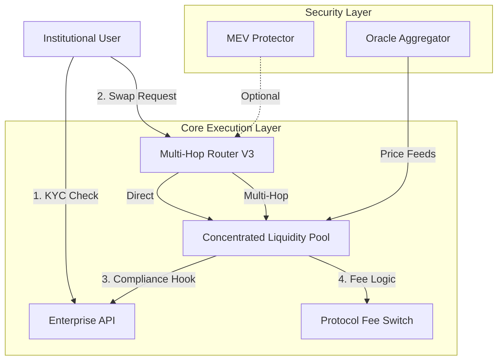

# Unified System Roadmap

**Date:** December 8, 2025
**Version:** 1.0

## 1. Vision

To establish Conxian as the premier "Institutional-Grade"
DeFi protocol on Stacks, characterized by:

* **Regulatory Compliance:** Built-in KYC/AML hooks and transaction monitoring.
* **Predictable Execution:** MEV protection and transparent routing.
* **Unified Architecture:** A single, cohesive codebase where all components
  (DEX, Lending, Governance) share common traits and security standards.

## 2. Strategic Pillars

### Pillar 1: Codebase Consolidation (Month 1)

* **Objective:** Eliminate redundant "dimensional" vs "standard" implementations.
* **Action Items:**
  * [x] Identify conflicting Router implementations (Done).
  * [x] Identify conflicting CLP implementations (Done).
  * [ ] Standardize Error Codes across all 50+ contracts to use `contracts/errors/standard-errors.clar`.
  * [ ] Unify Trait Definitions: Ensure every contract imports `.sip-standards` from the same source.

### Pillar 2: Institutional Hardening (Month 2)

* **Objective:** Verify and activate the "Enterprise" features.
* **Action Items:**
  * **Audit `enterprise-api`:** Verify that `compliance-hooks` are blocking non-KYC'd addresses in the `swap` function of the CLP.
  * **MEV Integration:** Benchmark the latency impact of the `mev-protector` commit-reveal scheme. Optimize if >2 blocks.
  * **Circuit Breakers:** Implement automated pause triggers for extreme price volatility (referencing `oracle-aggregator-v2`).

### Pillar 3: Developer Experience (Month 3)

* **Objective:** Make it easy for integrators to build on Conxian.
* **Action Items:**
  * **SDK Generation:** Auto-generate TypeScript SDK from the standardized Clarity traits.
  * **Documentation:** Publish the "Unified Context" diagram (see below) to the developer portal.
  * **Reg Test Suite:** Create a dedicated "Compliance Test Suite" that simulates regulatory scenarios (e.g., freezing a sanctioned address).

## 3. Unified Context Architecture

## 4. Immediate Next Steps

1. Complete the standardization of error codes (started in `dex/concentrated-liquidity-pool.clar`).
2. Run the full test suite to confirm no regressions from the recent cleanup.
